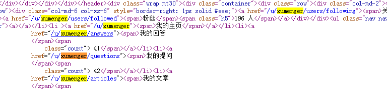
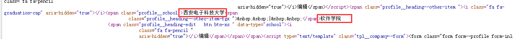
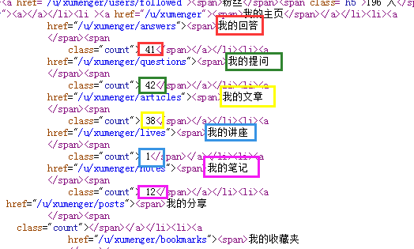

## 爬虫概述

爬取[https://segmentfault.com](https://segmentfault.com)这个网站，分析该网站的用户

* 获取声望值、徽章（金、银、铜）
* 获取地址、大学、专业、公司、职位、个人网站……
* 获取提问、回答、文章、笔记数量
* 获取关注数、粉丝数
* 获取关注的用户，获取对应用户的关注页面URL去继续爬取

进行以下层面的统计、分析：

* 城市分布（考虑有很多人没有填写城市的）
* 大学分布（考虑很多人没有填写学校，同一所学校可能有不同的称谓）
* 用户分布情况：
	* 关键用户：声望>=2000、回答数>=20、文章数>=20、粉丝数>=100
	* 活跃用户：声望>=500、回答数>=5、文章数>=5、粉丝数>=10
	* 不活跃用户：声望值<=100、回答数<=2、文章数<=2、粉丝数<=3
	* 一般用户：不属于以上范围的
	* 因为按照关注而不是粉丝的方向爬，所以很多不活跃用户估计直接就抓不到

**爬取和数据分析策略**

从起始地址：[https://segmentfault.com/u/xumenger/users/following](https://segmentfault.com/u/xumenger/users/following)开始爬取，所以对应的入口URL配置为：

```
"""start URL
config one or more StartURL
"""
startUrls = ['https://segmentfault.com/u/xumenger/users/following', 
            ]
```

>为了爬取更多有价值的用户，爬取每个用户的关注列表而不是粉丝列表

>将爬取的数据用Excel进行保存，然后针对Excel进行数据分析

>同时针对现有的代码进行充分的重构和优化

## URL分析

假如用户名是xumenger，则其关注用户的页面URL是[https://segmentfault.com/u/xumenger/users/following](https://segmentfault.com/u/xumenger/users/following)


获取用户名后，按照上面的规则拼接得到URL，然后直接将其扔到URL管理器中

只需要爬这一类URL页面就可以了，其他的页面不需要处理，所以对应的配置项为：

```
"""URL regular expression
config URL regular expression and it's deal class name
"""
urlREs = {'https://segmentfault.com/u/.*/users/following': 'following',
         }
```

## HTML分析

获取以下信息的功能，分别封装成函数

或者提供一个统一的函数

* 入参是：内容、对应的正则表达式
* 出参是：解析到的内容List
* 入参通过配置文件配置

分析HTML的一个技巧是【查看网页源码】，然后搜索对应的内容，查看其前后的HTML结构，给出对应的正则表达式表示

一下分别分析我[xumenger](https://segmentfault.com/u/xumenger/users/following)和另一个用户[吴隐隐](https://segmentfault.com/u/yinyin/users/following)的页面，起到一个对比的作用

**当前用户名**




可以根据这几条记录获取当前页面对应的当前用户名

选择下面的HTML解析获取当前用户名

```
href="/u/xumenger/answers"><span>我的回答
                                        
href="/u/yinyin/answers"><span>她的回答
```

搜索HTML，这种语句只有一条

正则表达式是：`href="/u/.*/answers"><span>`

**关注的用户**


每个用户得到关注是一个用户列表，可以在这里获取用户名，然后URL的规则拼成完整的URL

```
<a  href="/u/xumenger">xumenger</a><div class="profile-following--followed">
<a  href="/u/zach5078">zach5078</a><div class="profile-following--followed">
<a  href="/u/yinyin">吴隐隐</a><div class="profile-following--followed">
```

正则表达式是

**声望和徽章（金银铜）**


```
<a class="profile__rank-btn" href="/u/xumenger/rank"><span class="h4">4274</span><span class="profile__rank-btn-text">声望</span></a><div class="profile__heading--award-badge"><span class="badge badge--o badge--sf badge--gold"><i
            class="badge__icon"></i></span><span class="profile__heading--award-badge-count">2</span><span class="badge badge--o badge--sf badge--silver"><i
            class="badge__icon"></i></span><span class="profile__heading--award-badge-count">8</span><span class="badge badge--o badge--sf badge--bronze"><i
            class="badge__icon"></i></span><span class="profile__heading--award-badge-count">36</span></div></div><div class="profile__heading--other">
```

**大学和专业**




```
<i class="fa fa-graduation-cap" aria-hidden="true"></i><span class="profile__school">西安电子科技大学<span
        class="profile__heading--other-item-fgx ">&nbsp;&nbsp;|&nbsp;&nbsp;</span>软件学院
<span class="profile__heading-edit   btn btn-xs " data-type="school">
```

学校的正则表达式是：`<span class="profile__school">.*<span`

专业的正则表达式是：`</span>.*<span class="profile__heading-edit   btn btn-xs " data-type="school">`

**公司和职位**


```
<i class="fa fa-briefcase" aria-hidden="true"></i><span class="profile__company">恒生电子股份有限公司<span
        class="profile__heading--other-item-fgx ">&nbsp;&nbsp;|&nbsp;&nbsp;</span>Delphi开发
<span class="profile__heading-edit   btn btn-xs " data-type="company">
```

公司的正则表达式是：`<span class="profile__company">.*<span`

职位的正则表达式是：`</span>.*<span class="profile__heading-edit   btn btn-xs " data-type="company">`

**提问数/回答数/文章数/笔记数量/关注数/粉丝数**




```
href="/u/xumenger/answers"><span>我的回答
</span><span
    class="count"> 41</span></a></li><li><a
href="/u/xumenger/questions"><span>我的提问
</span><span
    class="count"> 42</span></a></li><li><a
href="/u/xumenger/articles"><span>我的文章
</span><span
    class="count"> 38</span></a></li><li><a
href="/u/xumenger/lives"><span>我的讲座
</span><span
    class="count"> 1</span></a></li><li><a
href="/u/xumenger/notes"><span>我的笔记
</span><span
    class="count"> 12</span></a></li>
```

## 开始爬取网站

执行`python start.py`运行程序

为了测试，这次不会将整个网站都爬下来。大概爬取了？条记录，存储在[Excel文件](./download/result.xlsx)中

Excel中的数据内容如下：


## 数据分析

爬取的结果已经存储在Excel文件中了，直接使用Excel文件对其中的数据进行分析即可得到一些关键的结果！

这里重点分析用户分布情况：

* 关键用户：声望>=2000、回答数>=20、文章数>=20、粉丝数>=100
* 活跃用户：声望>=500、回答数>=5、文章数>=5、粉丝数>=10
* 不活跃用户：声望值<=100、回答数<=2、文章数<=2、粉丝数<=3
* 一般用户：不属于以上范围的

分析结果如下


以上仅仅是我按照自己的经验指定的一个标准，只是为了演示如何进行简单的数据分析

